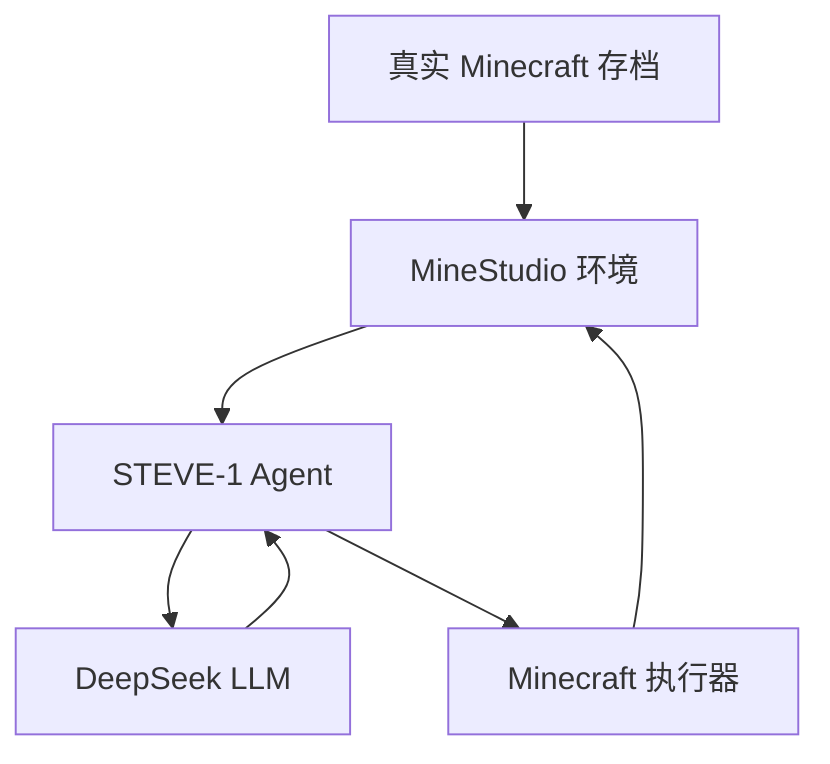
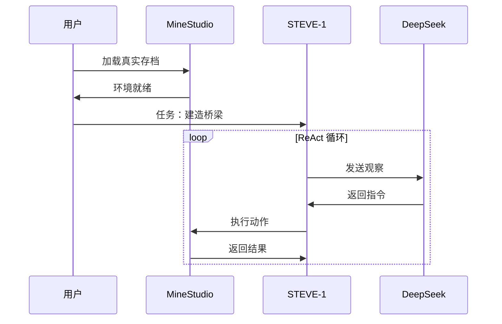

# 无人工地：基于 LLM + MineStudio 的自动造桥系统

## 1. 项目概述

**目标：** 在 Minecraft 真实存档环境中，利用 LLM 作为大脑，MineStudio Agent 作为执行器，实现自动桥梁建造。

**核心思路：** 加载真实存档 → LLM 理解地形 → Agent 自动执行建造。

## 2. 技术选型

| 组件 | 选型 | 说明 |
|------|------|------|
| Agent 模型 | STEVE-1 | 文本引导，资源适中 |
| LLM | DeepSeek API | 成本低，效果好 |
| 环境 | MineStudio + 真实存档 | 可加载 Minecraft 存档 |

## 3. 加载真实存档

### 3.1 Minecraft 存档位置

| 平台 | 路径 |
|------|------|
| Windows | `%APPDATA%\.minecraft\saves\` |
| Linux | `~/.minecraft/saves/` |
| macOS | `~/Library/Application Support/minecraft/saves/` |

### 3.2 存档结构

```
MySave/                    # 存档文件夹
├── level.dat             # 世界数据
├── level.dat_old         # 备份
├── region/               # 区块数据
│   ├── r.0.0.mca
│   ├── r.0.1.mca
│   └── ...
├── playerdata/           # 玩家数据
├── stats/               # 统计信息
└── ...
```

### 3.3 代码加载存档

```python
from minestudio.simulator.minerl.herobraine.env_specs.human_survival_specs import HumanSurvival
from minestudio.simulator.callbacks import RecordCallback, VoxelsCallback

# 存档路径（必须是文件夹）
SAVE_PATH = "./worlds/my_bridge_save"

# 创建环境
env = HumanSurvival(
    load_filename=SAVE_PATH,  # 加载真实存档
).make()

# 或通过 MinecraftSim（需要环境变量指定存档）
from minestudio.simulator import MinecraftSim
env = MinecraftSim(
    callbacks=[
        VoxelsCallback(voxels_ins=[-5, 5, -5, 5, -5, 5]),
        RecordCallback(record_path="./output"),
    ]
)
```

### 3.4 运行时命令控制

```python
# 通过 execute_cmd 发送命令
env.execute_cmd("/tp 0 64 0")           # 传送到坐标
env.execute_cmd("/setblock ~ ~ ~ gold_block")  # 放置标记
env.execute_cmd("/give @p stone 256")     # 给物品
```

## 4. 系统架构



## 5. 执行流程



## 6. 进度检测方案

### 6.1 可用观测接口

| 字段 | 说明 |
|------|------|
| `info['player_pos']` | 玩家坐标 `{'x', 'y', 'z'}` |
| `info['voxels']` | 周围方块 ID |
| `info['pov']` | 第一人称图像 |

### 6.2 VoxelsCallback 检测

```python
from minestudio.simulator.callbacks.voxels import VoxelsCallback

env = MinecraftSim(
    callbacks=[
        VoxelsCallback(voxels_ins=[-3, 3, -3, 3, -3, 3]),  # 7x7x7 范围
    ]
)
```

### 6.3 进度判断逻辑

```python
class BridgeProgress:
    def update(self, info):
        pos = info['player_pos']
        voxels = info.get('voxels')

        # 1. 检测起始点标记（金块 ID = 41）
        if voxels is not None and 41 in voxels:
            return "START_MARKER_FOUND"

        # 2. Y 坐标检测
        if pos['y'] < 62:  # 低于海平面，在水中
            return "IN_WATER"

        if pos['y'] == 63:  # 海平面，行走中
            return "ON_LAND"

        return "BUILDING"
```

## 7. ReAct + Memory 设计

### 7.1 组件

- **ShortTermMemory** — 最近 20 步记录
- **LongTermMemory** — 已完成目标、失败记录
- **ReactAgent** — Think → Action → Observe 循环

### 7.2 代码结构

```python
class ReactAgent:
    def think(self, task, observation, memory) -> str
    def act(self, instruction) -> result
    def observe(self, result, memory)
    def run_task(self, task)
```

## 8. 时间规划

```mermaid
gantt
    title 黑客马拉松 2 天计划
    dateFormat  HH
    section Day 1
    环境搭建、存档加载      :a1, 09:00, 2h
    LLM + Agent 集成      :a2, 11:00, 4h
    基础建桥流程打通      :a3, 15:00, 2h
    section Day 2
    进度检测优化          :b1, 09:00, 4h
    鲁棒性提升、演示      :b2, 13:00, 4h
```

## 9. 参考资料

- [MineStudio 文档](https://craftjarvis.github.io/MineStudio/)
- [STEVE-1 论文](https://arxiv.org/abs/2308.13188)
- [DeepSeek API](https://platform.deepseek.com/)
- [Malmo 存档加载](https://microsoft.github.io/malmo/0.37.0/World_Generation.html)
