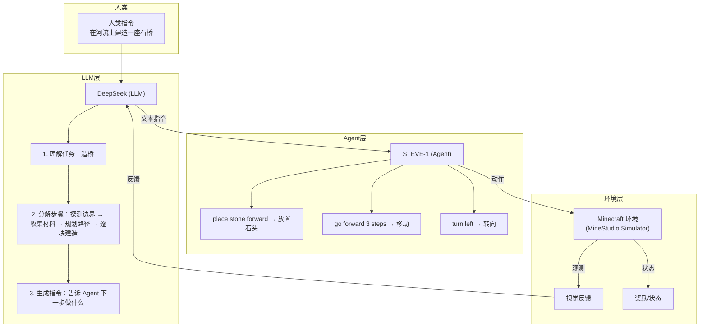
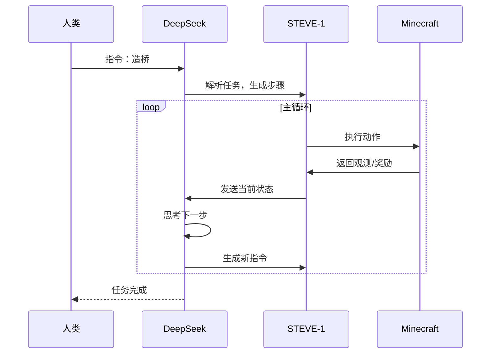
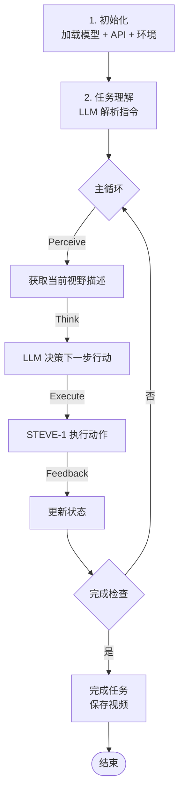

# 无人工地：基于 LLM + STEVE-1 的自动造桥系统

## 1. 项目概述

**目标：** 在 Minecraft 环境中，利用 LLM（DeepSeek）作为大脑，STEVE-1 作为执行器，实现自动化的桥梁建造。

**核心思路：** 人类给出"在两条河之间造一座桥"的指令，LLM 负责理解和规划，Agent 负责执行具体的建造动作。

## 2. 技术选型

### 2.1 Agent 模型：STEVE-1

| 特性 | 说明 |
|------|------|
| 控制方式 | 文本引导（Text Conditioning） |
| 资源需求 | 中等（~30M 参数） |
| 与 LLM 兼容性 | 原生支持，无缝衔接 |
| 优势 | 改 prompt 即可改变行为，灵活可控 |

**对比其他模型：**

| 模型 | 控制方式 | 资源 | LLM 集成难度 |
|------|----------|------|--------------|
| VPT | 无，纯视觉 | 低 | 需要额外映射层 |
| STEVE-1 | 文本指令 | 中 | **最简单** |
| GROOT | 视频/图像 | 高 | 需要视频编码 |
| ROCKET-1 | 分割掩码 | 最高 | 需要 SAM 分割 |

### 2.2 LLM：DeepSeek API

- **成本低：** 相比 GPT-4 性价比极高
- **能力强：** 编程和推理能力优秀
- **部署简单：** API 调用，无需本地 GPU

## 3. 系统架构





## 4. 实现方案

### 4.1 核心代码结构

```python
import os
import deepseek  # 或使用 openai 兼容接口
from minestudio.simulator import MinecraftSim
from minestudio.simulator.callbacks import RecordCallback
from minestudio.models import SteveOnePolicy

class LLMDrivenBridgeBuilder:
    def __init__(self):
        # 初始化 Agent
        self.agent = SteveOnePolicy.from_pretrained(
            "CraftJarvis/MineStudio_STEVE-1.official"
        ).to("cpu")
        self.agent.eval()

        # 初始化 LLM
        self.llm = DeepSeekAPI()

        # 环境
        self.env = MinecraftSim(
            obs_size=(128, 128),
            callbacks=[RecordCallback(record_path="./output", fps=30)]
        )

        self.state = "init"
        self.history = []

    def perceive(self, obs):
        """将视觉观察转换为文本描述"""
        # 可以接入视觉模型提取关键信息
        # 当前简化版本：直接询问 LLM 从图像描述判断
        return "玩家站在河边，河宽约5格，需要建造石桥连接对岸"

    def think(self, observation, task):
        """LLM 决策下一步行动"""
        prompt = f"""
当前任务：{task}
当前观察：{observation}
当前状态：{self.state}
历史行为：{self.history[-5:]}

请用简短的指令告诉 Agent 下一步应该做什么。
指令格式：动词 + 目标 + 方向/位置
示例：place stone forward, go forward, attack nearby tree

只输出一个指令，不要解释。
"""
        decision = self.llm.chat(prompt)
        return decision.strip()

    def execute(self, instruction):
        """执行 LLM 给出的指令"""
        # 准备 STEVE-1 的条件
        condition = self.agent.prepare_condition(
            {"text": [instruction], "cond_scale": 1.0},
            deterministic=False
        )

        obs, info = self.env.reset()
        memory = None

        # STEVE-1 推理
        action, memory = self.agent.get_action(
            {"image": obs["image"], "condition": condition},
            memory,
            input_shape="*"
        )

        obs, reward, terminated, truncated, info = self.env.step(action)
        return obs, reward, terminated, truncated

    def run(self, task, max_steps=1000):
        """主循环"""
        obs, info = self.env.reset()

        for step in range(max_steps):
            # 1. 感知
            perception = self.perceive(obs)

            # 2. 思考（LLM 决策）
            instruction = self.think(perception, task)
            print(f"Step {step}: {instruction}")
            self.history.append(instruction)

            # 3. 执行
            obs, reward, terminated, truncated = self.execute(instruction)

            if terminated or truncated:
                obs, info = self.env.reset()

            # 4. 检查是否完成（LLM 判断）
            if self.is_complete(perception):
                print("任务完成！")
                break

        self.env.close()
```

### 4.2 DeepSeek API 封装

```python
import openai

class DeepSeekAPI:
    def __init__(self, api_key=None):
        self.client = openai.OpenAI(
            api_key=api_key or os.getenv("DEEPSEEK_API_KEY"),
            base_url="https://api.deepseek.com"
        )

    def chat(self, prompt, model="deepseek-chat"):
        response = self.client.chat.completions.create(
            model=model,
            messages=[{"role": "user", "content": prompt}],
            temperature=0.7,
        )
        return response.choices[0].message.content
```

### 4.3 Prompt 工程

**系统级 Prompt：**

```
你是一个 Minecraft 造桥专家。你的任务是根据当前观察，
生成简短、精确的指令来控制 Agent 完成建桥任务。

约束：
1. 每次只生成一个指令
2. 指令必须是 Agent 可执行的动作描述
3. 优先考虑安全和稳定性
4. 建造顺序：先探测地形 → 收集材料 → 铺设桥面

可用指令类型：
- movement: go forward/backward/left/right N steps
- building: place stone/wood/dirt forward/left/right
- looking: turn left/right, look at target
- mining: attack nearby block
- inventory: select stone, select wood
```

## 5. 执行流程



## 6. 进阶优化

### 6.1 视觉感知增强

当前方案使用 LLM 直接"看"图描述，可以升级为：

- **接入 SAM** 进行实例分割，精确识别地形
- **接入 ResNet/ViT** 提取视觉特征送给 LLM
- **使用 ROCKET-1** 替代 STEVE-1，获取更强的视觉理解

### 6.2 记忆机制

```python
class Memory:
    def __init__(self):
        self.short_term = []  # 最近 10 步
        self.long_term = []   # 关键决策点

    def add(self, observation, decision, result):
        self.short_term.append((observation, decision, result))
        if len(self.short_term) > 10:
            self.long_term.append(self.short_term.pop(0))
```

### 6.3 并行探索

多个 Agent 并行执行，加速建桥过程：

```python
# 左中右三路同时建造
tasks = [
    "从左侧开始，向右铺设石头",
    "从中路开始，向两侧铺设石头",
    "从右侧开始，向左铺设石头"
]
```

## 7. 资源需求

| 组件 | 资源需求 | 说明 |
|------|----------|------|
| MineStudio 环境 | 4GB+ 显存 | 或 CPU + Xvfb |
| STEVE-1 模型 | 3-5GB 显存 | CPU 运行较慢 |
| DeepSeek API | 免费额度 | 超出后按 token 计费 |
| 总体 | 中等 | 适合黑客马拉松 |

## 8. 时间规划

```mermaid
gantt
    title 黑客马拉松 2 天计划
    dateFormat  HH
    section Day 1
    环境搭建、模型加载测试      :a1, 09:00, 2h
    LLM + Agent 集成、Prompt 调优 :a2, 11:00, 4h
    基本建桥流程打通            :a3, 15:00, 2h
    section Day 2
    优化感知、记忆机制          :b1, 09:00, 4h
    鲁棒性提升、演示准备         :b2, 13:00, 4h
```

## 9. 参考资料

- [STEVE-1 论文](https://arxiv.org/abs/2308.13188)
- [MineStudio 文档](https://craftjarvis.github.io/MineStudio/)
- [DeepSeek API 文档](https://platform.deepseek.com/)
- [VPT 论文](https://arxiv.org/abs/2206.11795)
