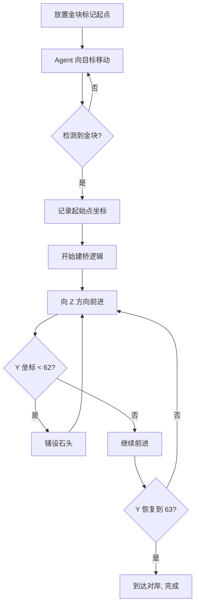

# 造桥进度检测方案

## 1. 可用观测接口

| 字段 | 说明 | 示例 |
|------|------|------|
| `info['player_pos']` | 玩家 3D 坐标 | `{'x': 100.5, 'y': 64.0, 'z': -23.2}` |
| `info['pov']` | 第一人称图像 | `(H, W, 3)` 数组 |
| `info['voxels']` | 周围方块信息 | 3D 数组 |

## 2. 特殊标记法（推荐）

使用 **VoxelsCallback** 检测特殊方块作为起始点标记。

### 常用方块 ID

| 方块 | ID |
|------|-----|
| 金块 | 41 |
| 钻石块 | 57 |
| 绿宝石块 | 133 |
| 混凝土 | 各种颜色 |

### 使用方法

```python
from minestudio.simulator.callbacks.voxels import VoxelsCallback
from minestudio.simulator.callbacks.record import RecordCallback

# 创建环境
env = MinecraftSim(
    obs_size=(128, 128),
    callbacks=[
        VoxelsCallback(voxels_ins=[-3, 3, -3, 3, -3, 3]),  # 7x7x7 区域
        RecordCallback(record_path="./output", fps=30),
    ]
)

# 检测标记（金块 ID = 41）
def detect_marker(info):
    voxels = info.get('voxels')
    if voxels is not None:
        for block in voxels.flatten():
            if block == 41:  # 金块
                return True
    return False
```

## 3. 进度判断逻辑

```python
class BridgeProgress:
    def __init__(self):
        self.start_marker_found = False
        self.start_pos = None
        self.bridge_length = 0

    def update(self, info):
        pos = info['player_pos']
        voxels = info.get('voxels', None)

        # 1. 检测起始点标记
        if not self.start_marker_found:
            if voxels is not None and 41 in voxels:  # 金块
                self.start_marker_found = True
                self.start_pos = pos
                self.bridge_length = 0
                return "START_MARKER_FOUND"

        # 2. Y 坐标检测（落入水中 = 到达河流边缘）
        if pos['y'] < 62:  # 低于海平面
            return "IN_WATER"

        # 3. 到达对岸（Y 恢复到 63）
        if self.start_pos and pos['y'] == 63:
            return "CROSSED"

        return "BUILDING"
```

## 4. 完整执行流程



## 5. 游戏内放置标记

在 Minecraft 中执行以下命令放置标记：

```
/setblock ~ ~ ~ gold_block
```

或者使用命令方块：

```
/setblock ~ ~ ~ minecraft:gold_block
```
