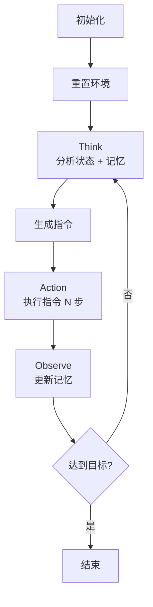

# ReAct + Memory 设计方案

## 1. 目标

将 `run_steve1_bridge.py` 从简单的序列执行器改造为具有动态决策和记忆能力的 Agent。

## 2. 参考架构

### OpenClaw 设计思路
- **ReAct 模式**: Think → Action → Observe 循环
- **记忆系统**: Short-term + Long-term memory

## 3. 新增组件

### 3.1 ShortTermMemory（短期记忆）

```python
@dataclass
class StepRecord:
    step: int
    action: str
    observation: str
    reward: float
    done: bool
    timestamp: float

class ShortTermMemory:
    def __init__(self, max_len: int = 20):
        self.buffer = deque(maxlen=max_len)

    def add(self, record: StepRecord)
    def get_recent(self, n: int = 5) -> List[StepRecord]
    def summarize(self) -> str  # 返回 "action: reward; action: reward" 格式
    def clear(self)
```

**作用**: 保存最近 N 步的执行记录，用于判断当前状态。

### 3.2 LongTermMemory（长期记忆）

```python
class LongTermMemory:
    def __init__(self):
        self.completed_goals: List[str] = []
        self.failed_attempts: List[Dict] = []
        self.key_decisions: List[Dict] = []

    def add_goal(self, goal: str)
    def add_decision(self, decision: str, reason: str)
    def add_failure(self, instruction: str, reason: str)
    def get_context(self) -> str  # 返回历史上下文摘要
```

**作用**: 保存已完成目标、失败记录，供决策参考。

### 3.3 ReactAgent（ReAct 执行器）

```python
class ReactAgent:
    def __init__(self, model, env):
        self.short_term = ShortTermMemory()
        self.long_term = LongTermMemory()

    def think(self, task: str, observation: str) -> str:
        """
        分析当前状态，决定下一步行动
        输入: 当前任务 + 观察 + 记忆摘要
        输出: 具体指令（如 "place stone forward"）
        """

    def act(self, instruction: str) -> Tuple[obs, reward, done, steps]:
        """
        执行指令，返回结果
        """

    def observe(self, instruction: str, result: InstructionResult):
        """
        根据执行结果更新记忆
        """

    def run_task(self, task: str, max_instructions: int = 20) -> List[InstructionResult]:
        """
        主循环: Think → Action → Observe
        """
```

## 4. 类结构调整

### Before
```
BridgeBuilder
├── model: SteveOnePolicy
├── env: MinecraftSim
├── memory: None
└── run_sequence(instructions)  # 简单循环
```

### After
```
BridgeBuilder
├── model: SteveOnePolicy
├── env: MinecraftSim
└── agent: ReactAgent
    ├── short_term: ShortTermMemory
    ├── long_term: LongTermMemory
    ├── think()
    ├── act()
    ├── observe()
    └── run_task()  # ReAct 主循环
```

## 5. 执行流程



## 6. 修改文件

- `hackathon/run_steve1_bridge.py`

## 7. 验证方式

```bash
python hackathon/run_steve1_bridge.py
```

预期输出：
```
开始任务: 建造一座通往对岸的石桥
==================================================

[Step 1] Think: 分析当前状态...
[Step 1] Action: 执行 go forward...
[Step 1] Observe: reward=0.00, steps=50

[Step 2] Think: 分析当前状态...
[Step 2] Action: 执行 place stone forward...
[Step 2] Observe: reward=1.00, steps=30
...
```
