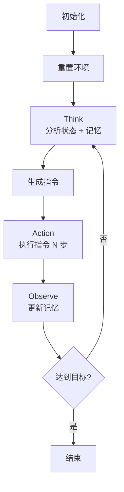

# ReAct + Memory 设计方案

## 1. 目标

将 `run_steve1_bridge.py` 从简单的序列执行器改造为具有动态决策和记忆能力的 Agent。

## 2. 参考架构

### OpenClaw 设计思路
- **ReAct 模式**: Think → Action → Observe 循环
- **记忆系统**: Short-term + Long-term memory

## 3. 新增组件

### 3.1 ShortTermMemory（短期记忆）

```python
@dataclass
class StepRecord:
    step: int
    action: str
    observation: str
    reward: float
    done: bool
    timestamp: float

class ShortTermMemory:
    def __init__(self, max_len: int = 20):
        self.buffer = deque(maxlen=max_len)

    def add(self, record: StepRecord)
    def get_recent(self, n: int = 5) -> List[StepRecord]
    def summarize(self) -> str  # 返回 "action: reward; action: reward" 格式
    def clear(self)
```

**作用**: 保存最近 N 步的执行记录，用于判断当前状态。

### 3.2 LongTermMemory（长期记忆）

```python
class LongTermMemory:
    def __init__(self):
        self.completed_goals: List[str] = []
        self.failed_attempts: List[Dict] = []
        self.key_decisions: List[Dict] = []

    def add_goal(self, goal: str)
    def add_decision(self, decision: str, reason: str)
    def add_failure(self, instruction: str, reason: str)
    def get_context(self) -> str  # 返回历史上下文摘要
```

**作用**: 保存已完成目标、失败记录，供决策参考。

### 3.3 ReactAgent（ReAct 执行器）

```python
class ReactAgent:
    def __init__(self, model, env):
        self.short_term = ShortTermMemory()
        self.long_term = LongTermMemory()

    def think(self, task: str, observation: str) -> str:
        """
        分析当前状态，决定下一步行动
        输入: 当前任务 + 观察 + 记忆摘要
        输出: 具体指令（如 "place stone forward"）
        """

    def act(self, instruction: str) -> Tuple[obs, reward, done, steps]:
        """
        执行指令，返回结果
        """

    def observe(self, instruction: str, result: InstructionResult):
        """
        根据执行结果更新记忆
        """

    def run_task(self, task: str, max_instructions: int = 20) -> List[InstructionResult]:
        """
        主循环: Think → Action → Observe
        """
```

## 4. 类结构调整

### Before
```
BridgeBuilder
├── model: SteveOnePolicy
├── env: MinecraftSim
├── memory: None
└── run_sequence(instructions)  # 简单循环
```

### After
```
BridgeBuilder
├── model: SteveOnePolicy
├── env: MinecraftSim
└── agent: ReactAgent
    ├── short_term: ShortTermMemory
    ├── long_term: LongTermMemory
    ├── think()
    ├── act()
    ├── observe()
    └── run_task()  # ReAct 主循环
```

## 5. 执行流程



## 6. 修改文件

- `hackathon/run_steve1_bridge.py`

## 7. 验证方式

```bash
python hackathon/run_steve1_bridge.py
```

预期输出：
```
开始任务: 建造一座通往对岸的石桥
==================================================

[Step 1] Think: 分析当前状态...
[Step 1] Action: 执行 go forward...
[Step 1] Observe: reward=0.00, steps=50

[Step 2] Think: 分析当前状态...
[Step 2] Action: 执行 place stone forward...
[Step 2] Observe: reward=1.00, steps=30
...
```

## 8. 基于观察结果决策

### 8.1 核心流程

```
Observe 结果 → 分析状态 → Think → 下一个动作
```

### 8.2 Think: 基于观察决策

```python
def think(self, task: str, observation: dict) -> str:
    """
    基于观察结果 + 记忆决定下一步行动

    决策输入：
    - task: 当前任务
    - observation: 当前观察 {'pos', 'voxels', 'reward'}
    - short_term: 近期记忆摘要
    - long_term: 历史上下文
    """
    # 1. 提取当前状态
    pos = observation.get('pos', {})
    y = pos.get('y', 63)
    voxels = observation.get('voxels')
    reward = observation.get('reward', 0)

    # 2. 获取记忆上下文
    recent = self.short_term.summarize()
    context = self.long_term.get_context()

    # 3. 规则决策
    # 在水中 → 铺路
    if y < 62:
        if 'place' in recent:
            return "go forward"
        return "place stone forward"

    # 在陆地，看到水 → 准备过河
    if y == 63 and voxels is not None:
        if 9 in voxels:  # 水方块 ID = 9
            return "place stone forward"

    # 默认 → 继续前进
    return "go forward"
```

### 8.3 决策规则表

| 当前状态 | 观察结果 | 下一步动作 |
|---------|----------|-----------|
| 在水中 (y < 62) | - | 放置石头 |
| 在陆地 (y = 63) | 附近有水 | 放置石头前进 |
| 在陆地 | 无水 | 继续前进 |
| 检测到金块 | 标记点 | 开始建桥 |

### 8.4 Observe: 更新记忆

```python
def observe(self, instruction: str, result: InstructionResult):
    """
    根据执行结果更新记忆

    1. 判断成功/失败
    2. 写入短期记忆
    3. 更新长期记忆
    """
    # 1. 判断结果
    success = result.reward > 0 or result.total_steps < 50

    # 2. 创建记录
    record = StepRecord(
        step=self.global_step,
        action=instruction,
        observation=f"reward={result.reward:.2f}",
        reward=result.reward,
        done=result.done,
    )

    # 3. 更新短期记忆
    self.short_term.add(record)

    # 4. 更新长期记忆
    if success:
        self.long_term.add_goal(instruction)
        self.long_term.add_decision(
            instruction,
            f"成功: reward={result.reward:.2f}, steps={result.total_steps}"
        )
    else:
        self.long_term.add_failure(
            instruction,
            f"失败: reward={result.reward:.2f}, steps={result.total_steps}"
        )

    # 5. 打印日志
    status = "✓" if success else "✗"
    print(f"  [Observe] {status} {instruction}: reward={result.reward:.2f}")
```

### 8.5 主循环

```python
def run_task(self, task: str, max_instructions: int = 20):
    obs, info = self.env.reset()

    for i in range(max_instructions):
        # Think: 基于观察 + 记忆决策
        observation = {
            'pos': info.get('player_pos'),
            'voxels': info.get('voxels'),
            'reward': 0,
        }
        instruction = self.think(task, observation)
        print(f"\n[Step {i+1}] Think: {instruction}")

        # Action: 执行指令
        print(f"[Step {i+1}] Action: 执行中...")
        obs, total_reward, done, steps, step_logs = self.act(instruction)

        # 创建结果
        result = InstructionResult(
            instruction=instruction,
            success=total_reward > 0,
            reward=total_reward,
            total_steps=steps,
            observations=[log['observation'] for log in step_logs],
        )

        # Observe: 更新记忆
        self.observe(instruction, result)

        if done:
            obs, info = self.env.reset()

