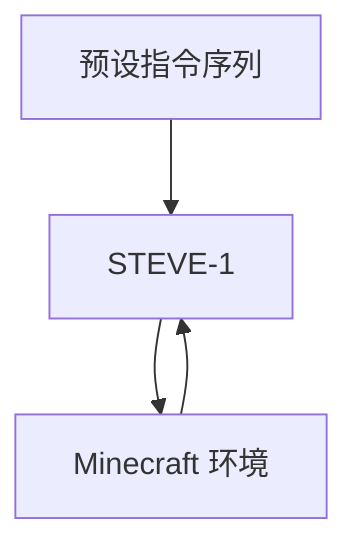

# 黑客马拉松：无人工地 - 自动造桥

## 项目目标

在 Minecraft 环境中，利用 STEVE-1 实现自动桥梁建造。

## 目录结构

```
hackathon/
├── README.md              # 本文件
├── Dockerfile            # Docker 配置
├── run_steve1_bridge.py # 核心代码
└── output/              # 生成视频
```

## 本地运行

```bash
python hackathon/run_steve1_bridge.py
```

## Docker 运行

### 构建镜像

```bash
docker build --platform=linux/amd64 -t minestudio -f hackathon/Dockerfile .
```

### 运行容器

**Linux/macOS：**

```bash
docker run -it --rm \
  -v $(pwd)/hackathon:/workspace/hackathon \
  -w /workspace/hackathon \
  minestudio \
  python run_steve1_bridge.py
```

**Windows PowerShell：**

```powershell
docker run -it --rm -v ${PWD}\hackathon:/workspace/hackathon -w /workspace/hackathon minestudio python run_steve1_bridge.py
```

## 技术方案

| 组件 | 说明 |
|------|------|
| Agent 模型 | STEVE-1（文本引导） |
| 控制方式 | 预设动作序列或 LLM 动态生成 |
| 环境 | MineStudio Minecraft Simulator |

## 架构



## 下一步

- [ ] 接入 DeepSeek LLM 动态生成指令
- [ ] 增加视觉感知判断河流边界
- [ ] 优化指令序列提升建桥效率
